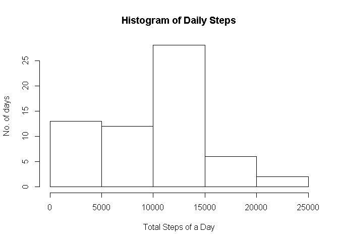
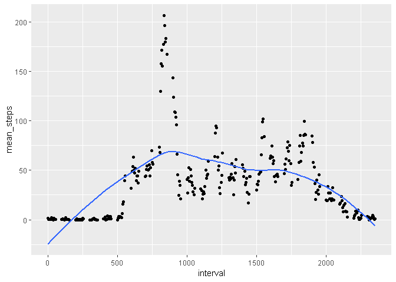
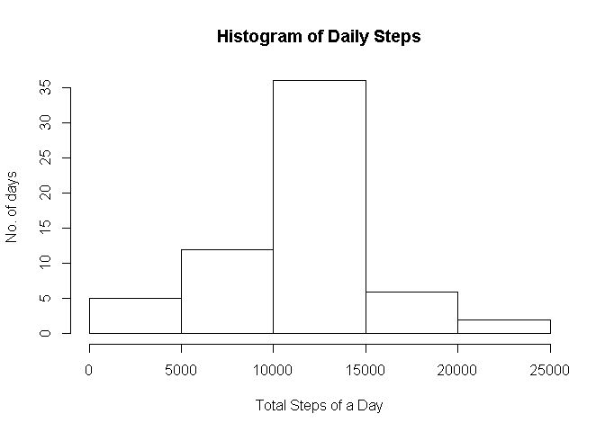
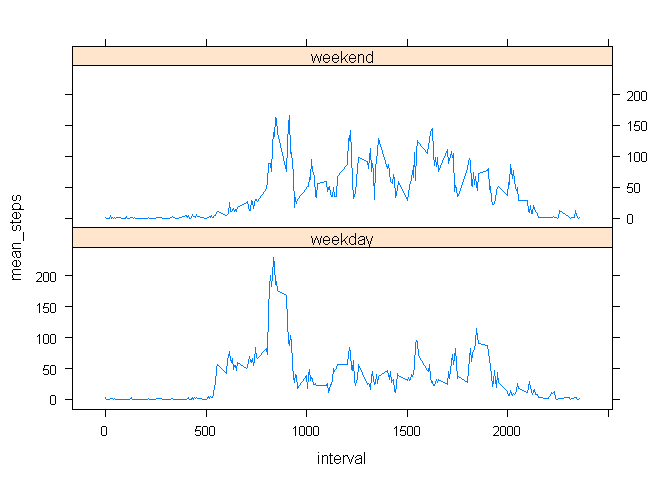

## Loading and preprocessing the data
* Unzip the "activity.zip" file and load the data

```r
unzip("activity.zip")
activity <- read.csv("activity.csv")
```


## What is mean total number of steps taken per day?
- Calculate the total number of steps for each day

```r
library(dplyr)
```

```
## 
## Attaching package: 'dplyr'
```

```
## The following objects are masked from 'package:stats':
## 
##     filter, lag
```

```
## The following objects are masked from 'package:base':
## 
##     intersect, setdiff, setequal, union
```

```r
daily_steps <- activity %>% group_by(date) %>% summarise(total_steps=sum(steps, na.rm=T))
hist(daily_steps$total_steps, xlab="Total Steps of a Day",ylab="No. of days",main = "Histogram of Daily Steps")
```

<!-- -->
- Mean and Median of total steps of a day

```r
mean_step <-mean(daily_steps$total_steps)
median_step <- median((daily_steps$total_steps))
sprintf("Mean = %f    Median = %f", mean_step, median_step )
```

```
## [1] "Mean = 9354.229508    Median = 10395.000000"
```

## What is the average daily activity pattern?
- Average number of steps taken across all day at 5 minutes interval

```r
library(ggplot2)
interval_steps <- activity %>% group_by(interval) %>% summarise(mean_steps=mean(steps, na.rm=T))
qplot(interval, mean_steps, data=interval_steps)+geom_smooth(se=F)
```

```
## `geom_smooth()` using method = 'loess' and formula 'y ~ x'
```

<!-- -->
- The time interval with highest average steps

```r
interval_steps[interval_steps$mean_steps==max(interval_steps$mean_steps),1]
```

```
## # A tibble: 1 x 1
##   interval
##      <int>
## 1      835
```

## Imputing missing values
-Count the number of missing value in steps

```r
count(activity[is.na(activity$steps)==TRUE,])
```

```
## # A tibble: 1 x 1
##       n
##   <int>
## 1  2304
```
- Impute the missing value with mean for the 5-minute interval

```r
## Join the activity table and interval_steps together
join_activity <- arrange(left_join(activity,interval_steps), interval)
```

```
## Joining, by = "interval"
```

```r
join_activity$steps[is.na(join_activity$steps)] <- join_activity$mean_steps[is.na(join_activity$steps)]
```
- Calculate the total number of steps for each day with imputed dataset

```r
new_daily_steps <- join_activity %>% group_by(date) %>% summarise(total_steps=sum(steps, na.rm=T))
hist(new_daily_steps$total_steps, xlab="Total Steps of a Day",ylab="No. of days",main = "Histogram of Daily Steps")
```

<!-- -->
- Calculate the Mean and Median of the total steps of a day with new dataset

```r
mean_step <-mean(new_daily_steps$total_steps)
median_step <- median((new_daily_steps$total_steps))
sprintf("Mean = %f    Median = %f", mean_step, median_step )
```

```
## [1] "Mean = 10766.188679    Median = 10766.188679"
```

## Are there differences in activity patterns between weekdays and weekends?
-Create a new variable day type which indicates whether the day is in weekday or weekend, and make a panel plot according to time series and break into weekdays and weekends


```r
weekdays <- weekdays(as.Date(join_activity$date))
join_activity$day <- weekdays
join_activity$day_type <- ifelse(join_activity$day %in% c("Saturday", "Sunday"), "weekend","weekday")
mean_interval <- join_activity %>% group_by(interval,day_type) %>% summarise(mean_steps=mean(steps))
library(lattice)
xyplot(mean_steps ~ interval | day_type, data=mean_interval, layout=c(1,2), type="l")
```

<!-- -->
